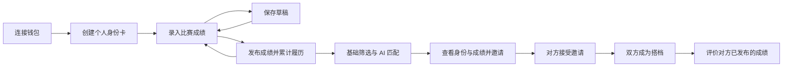

# RoxMate 当前业务流程与操作指南

更新：2026-09-04。目标架构为公开身份、已发布成绩和信誉事实以 Monad 合约为最终数据源；草稿仅保存在浏览器本地，AI 服务不持久化业务数据。

## 业务流程



1. **连接钱包**：在安装钱包扩展的浏览器或兼容的钱包内置浏览器打开 http://localhost:3000。点击「连接钱包」，选择账户并切换到 Monad Testnet（10143）。钱包地址即页面身份，不创建服务端会话；没有钱包时明确提示。
2. **身份卡**：填写昵称、城市和介绍，不收集精确训练时间或联系方式。按意愿开启「允许被推荐」和 AI 分析授权。保存时由钱包确认交易并支付 Gas，链上确认后刷新仍可读取。
3. **比赛成绩**：进入「我的成绩」，填写比赛名称、日期、地点、组别及本人项目用时、距离、负重或次数。至少一项个人项目成绩才可发布。发布交易由用户钱包确认并支付 Gas；未知数据留空，不使用双人总成绩推算个人能力。
4. **草稿与多次提交**：资料不完整时保存草稿，从身份卡的比赛履历继续编辑。发布后成绩不能覆盖修改；使用「新建成绩」提交下一场。每场比赛独立保存，草稿仅本人可见。
5. **AI 找搭子**：点击「开始匹配」。浏览器直接从链上公开、同城、允许被推荐的身份卡中按游标读取，每次最多读取 10 位候选人，不做全量扫描；每位候选人最多读取最近 5 场成绩，只对比同组别、同工作量的项目。开启 AI 授权后，浏览器仅将匿名基础匹配信号发送到无状态 `/api/ai` 代理，由代理调用模型生成中文解释；AI 未配置或失败时自动回退到前端基础匹配。
6. **建立搭档关系**：查看候选身份与已发布成绩，点击「邀请成为搭档」。对方进入「我的搭档」接受或拒绝。发出邀请表示发起方同意，接收方接受后关系成立；AI 推荐不会自动建立关系。
7. **评价**：在「我的搭档」查看对方成绩，选择 GOOD / BAD，可附说明。仅已接受邀请的搭档能够评价对方已发布成绩；不能评价自己，每人每条成绩一次，提交后不能修改。同一搭档的不同比赛可分别评价。评价保存后，详情和成绩卡片计数同步更新。

## AI 规则与配置

服务端文件：`apps/web/.env.local`。

```dotenv
APP_ORIGIN=http://localhost:3000
AI_MATCH_URL=https://api.deepseek.com/chat/completions
AI_MATCH_MODEL=deepseek-v4-flash
AI_API_KEY=在本地填写实际密钥
```

密钥仅由服务端读取，不使用 `NEXT_PUBLIC_` 前缀。当前密钥已完成真实调用验证。生产部署更换域名时同时更新 APP_ORIGIN；使用 HTTPS。更改环境变量后重启服务以确保生效。

发送给模型的内容仅包括临时候选编号、基础匹配分、可比项目数和匹配理由；不发送钱包地址、昵称、个人介绍、比赛名称、地点或联系方式。AI 代理不保存业务数据，服务端校验请求大小和返回格式。

页面明确区分「AI 分析」与「基础匹配」。未授权、缺少配置、模型错误、返回格式无效或超时，均使用基础匹配并说明原因。AI 代理单次最多处理 10 位候选人，20 秒超时。

基础规则分由同城 35 分、至少 3 项可比时的相似度最多 55 分、双方在不同项目各有明显优势 10 分组成。该分数用于匹配，不是运动员评级；AI 调整推荐顺序和理由，不改写基础规则分。

协议参考：[DeepSeek 官方接口文档](https://api-docs.deepseek.com/zh-cn/)。

## 本地运行

新环境只需参照根目录 README 配置 Monad RPC 和合约地址；AI 为可选配置。

```bash
cd apps/web
npm install
npm run dev
```

合约已提供个人链上读写与分页接口；个人页面直接通过 Monad RPC 读取、通过钱包写入，前端执行基础匹配，仅保留无状态 `/api/ai` 代理。原合约的旧双人接口仍保留，不代表官方赛事成绩认证。

## 验证结果与复现

本轮针对当前个人流程验证，不把旧版演示流程的历史报告当作新版本测试结果。

| 验证 | 结果与范围 |
| --- | --- |
| 当前接口回归 | 57/57 通过：真实密码学签名、nonce 重放和域名/URI校验、权限、草稿与多场成绩、公开设置、邀请、评价唯一性与统计、退出 |
| AI 适配器 | 10/10 通过：本地模型桩验证协议、匿名化、授权过滤、非法候选拒绝、限流降级、不同工作量过滤 |
| DeepSeek 真实调用 | 使用临时合成成绩，成功返回 AI 模式、有效候选与中文理由；详见 JSON 证据 |
| 浏览器流程 | 在隔离端口 3001 使用临时签名钱包完成身份卡、草稿刷新保留、发布、接受邀请、评价与计数回归 |
| 手机端 | 375×812 视口检查，页面无横向溢出；已检查成绩与评价布局 |
| TypeScript | `npm run lint` 通过（该脚本执行 `tsc --noEmit`） |
| 生产构建 | 通过；在源代码隔离副本执行 `npm run build`，避免干扰运行中的开发服务 |

浏览器测试使用能生成真实签名的临时注入 provider，不等同于对 MetaMask 等实际钱包扩展弹窗的人工验收。正式前端不包含该 provider；测试账号、记录、邀请、评价已清理。实际扩展的账户选择、网络切换和签名弹窗仍需在用户自己的钱包浏览器中体验确认。当前接入注入式浏览器钱包，未实现 WalletConnect 扫码连接。

验证命令：`cd apps/web && npm run lint`；合约命令：`cd contracts && forge test`。

测试证据：

- [桌面身份卡截图](qa/personal-workflow/identity-desktop.jpg)
- [手机搭档评价截图](qa/personal-workflow/partner-review-mobile.jpg)

## 当前接口边界

个人业务不依赖服务端认证或业务 API：身份、成绩、邀请、评价和公开候选人均由浏览器直接读取合约，写入由用户钱包签名。当前唯一的 API Route 是 `POST /api/ai`，只转发匿名匹配信号，不持久化业务数据；未配置 AI 时不调用该接口。
