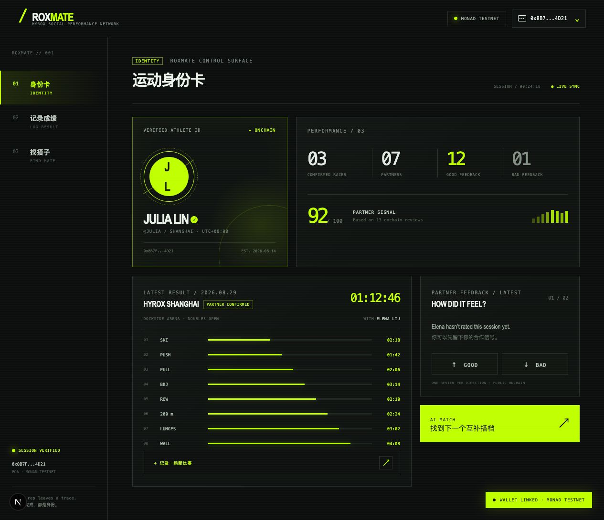
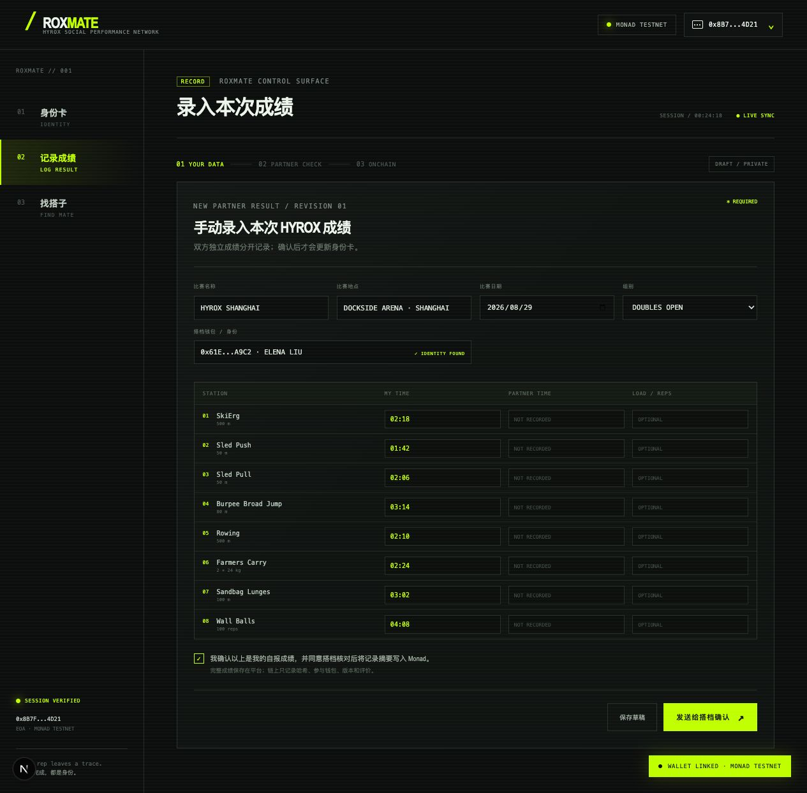
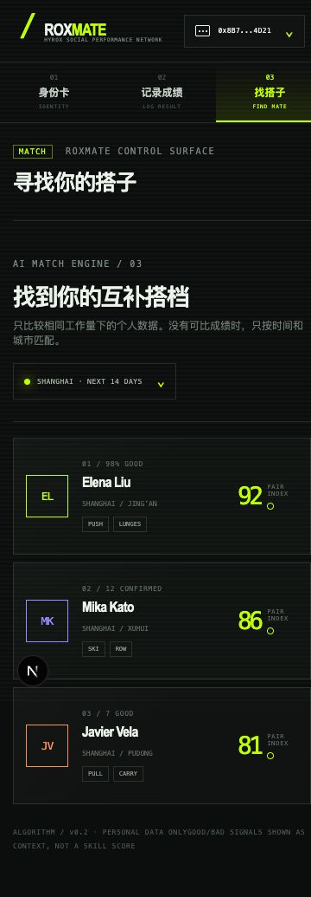
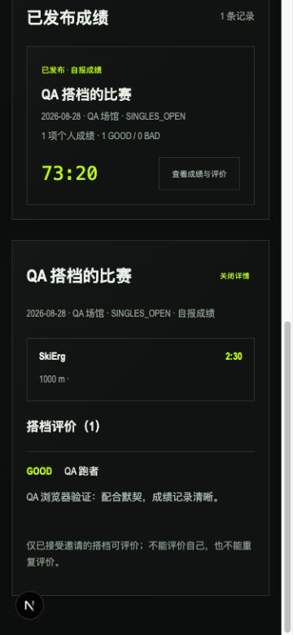

# RoxMate

> **YOUR OWN RECORD. YOUR NEXT PARTNER.**

**HYROX × Monad 的链上运动身份与搭档发现平台。**

RoxMate 把分散的比赛成绩变成可携带、可验证的运动身份，并帮助运动者找到真正合拍的下一位搭档。用户通过钱包建立个人身份卡，记录每场比赛表现，基于城市、组别和工作量发现候选人，在完成搭档关系后留下真实评价。

<p>
  <a href="https://roxmate-one.vercel.app/">🚀 在线体验</a> ·
  Monad Testnet · Chain ID <code>10143</code>
</p>

## 赛道契合度

RoxMate 同时回应两个参赛方向：一个关注开放社交关系、注意力分配与社区文化，另一个关注真正由 KIMI 驱动的 AI 产品体验。

### 社会、注意力和文化

- **开放的社交图谱**：运动员身份、比赛成绩和搭档关系组成可验证的链上关系网络。
- **更有效的注意力分配**：不依赖无限信息流，而是根据城市、组别、项目表现和工作量，把用户注意力引导到真正合拍的候选人。
- **社区信任与协作文化**：搭档确认和 GOOD / BAD 评价沉淀真实的合作信号，让社区关系不止停留在关注或点赞。
- **真正的用户所有权**：运动履历和关系状态由用户钱包发起写入 Monad，身份和贡献不被单一平台锁定。

### KIMI / Kimi K3

- **AI 参与核心决策链路**：Kimi K3 不是装饰性聊天入口，而是负责解释“为什么这个人适合成为我的搭档”。
- **规则与模型协作**：浏览器端规则引擎先保证城市、组别和可比项目等匹配边界，再由 Kimi K3 将匿名信号转化为自然语言建议。
- **AI 原生但不牺牲可验证性**：链上数据提供事实，规则引擎提供可解释的匹配依据，Kimi K3 负责降低理解成本。
- **隐私优先**：发送给 Kimi K3 的只有分数、可比项目数量和规则理由等匿名信号，不包含钱包地址、昵称或个人介绍。

这两个方向在 RoxMate 中形成一个完整闭环：链上运动记录构建社交图谱，匹配机制重新组织注意力，Kimi K3 帮助用户理解关系，搭档评价再把一次合作沉淀为社区文化。

## 为什么是 RoxMate？

HYROX 的成绩不只是一个最终用时。搭档是否合拍，还取决于每个项目的节奏、力量分配和协作体验。RoxMate 将这些信息组织成一张公开但由用户掌控的运动身份卡，让“找搭子”从凭感觉，变成基于真实表现的匹配。

## 核心体验

- **建立运动身份**：钱包地址就是身份入口，创建公开的运动员名片。
- **记录个人履历**：记录 HYROX 8 个项目、比赛日期、组别、用时及负重/次数等信息。
- **发现合拍搭档**：基于城市、组别和可比较的项目表现筛选候选人，并提供匹配分数。
- **确认真实关系**：搭档邀请、接受和关系状态写入 Monad Testnet，双方共享同一份事实。
- **留下搭档评价**：完成合作后，对已发布成绩留下 GOOD / BAD 反馈，积累可参考的协作信号。
- **Kimi K3 匹配解释**：Kimi K3 只接收匿名的可比成绩摘要，用于解释匹配原因，不发送钱包、昵称或个人介绍。

## 产品流程

```text
连接钱包 → 创建运动身份 → 记录比赛成绩 → 找到匹配搭档 → 确认搭档关系 → 互相评价
```

## 产品预览

<table>
  <tr>
    <td width="50%"></td>
    <td width="50%"></td>
  </tr>
  <tr>
    <td align="center">运动身份卡 · Personal Records</td>
    <td align="center">比赛成绩录入 · Log Result</td>
  </tr>
  <tr>
    <td width="50%"></td>
    <td width="50%"></td>
  </tr>
  <tr>
    <td align="center">找搭子 · Find Mate</td>
    <td align="center">搭档评价 · Partner Review</td>
  </tr>
</table>

## 为什么使用 Monad？

RoxMate 将运动身份、比赛成绩、搭档关系和评价记录在 Monad Testnet 上，形成公开、可验证且不依赖单一平台数据库的运动履历。用户保有自己的钱包和写入权，产品只负责提供更好的记录、发现和协作体验。

## 技术栈

| 层 | 技术 |
| --- | --- |
| Web | Next.js 15 · React 19 · TypeScript |
| Wallet | viem |
| Smart contract | Solidity · OpenZeppelin · Foundry |
| Network | Monad Testnet · Chain ID `10143` |
| Matching | 浏览器端规则匹配 + Kimi K3 匹配解释 |

Registry 合约：`0x601c5e9007e52950575b46b84415b152853685d0`

## Kimi K3 如何参与匹配

RoxMate 先在浏览器端读取公开的链上候选人，并根据城市、组别和可比较项目计算基础匹配分数；获得用户授权后，再将分数、可比项目数量和规则理由等匿名信号交给 Kimi K3，生成更容易理解的匹配解释。

这样，链上数据负责提供可验证的事实，规则引擎负责保持匹配边界，Kimi K3 负责把结果解释成用户能快速理解的建议。

## Demo & Submission

- **Live Demo**：[roxmate-one.vercel.app](https://roxmate-one.vercel.app/)
- **Network**：Monad Testnet
- **Tracks**：社会、注意力和文化 · KIMI / Kimi K3
- **AI Model**：Kimi K3
- **状态**：MVP / Hackathon prototype

线上 Demo 主要用于展示产品体验；连接钱包和链上写入需要兼容的钱包以及 Monad Testnet 测试币。

## 下一步

- 完善双钱包端到端的搭档确认体验
- 增加更丰富的成绩趋势、分页和通知能力
- 支持更多赛事类型与训练数据来源
- 进一步完善移动端交互和生产环境监控
