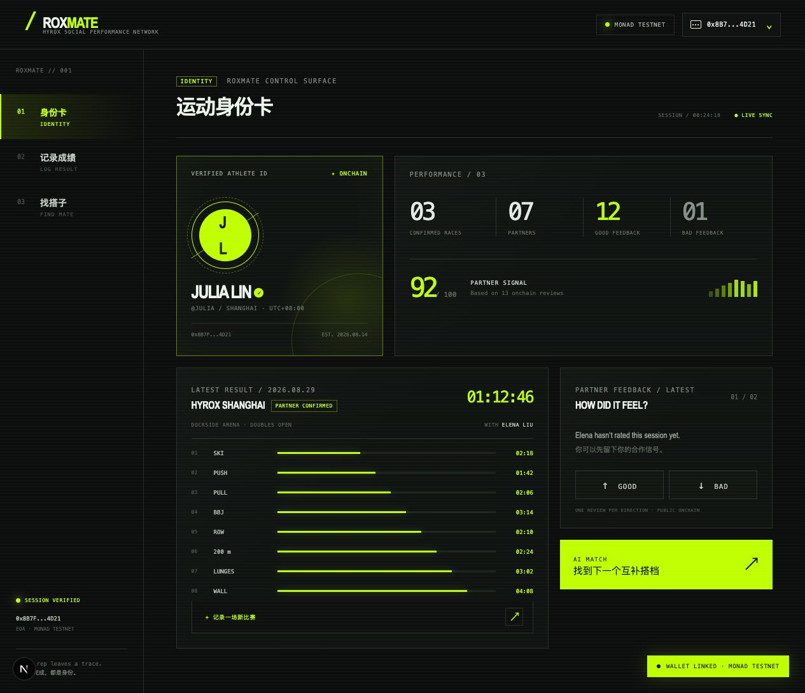
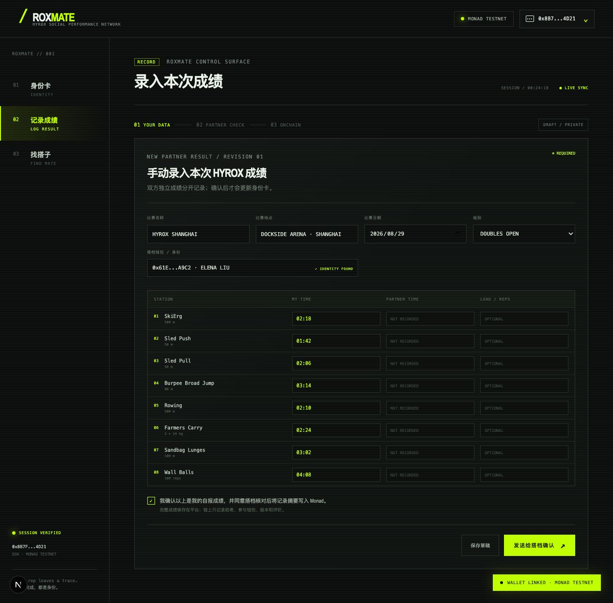
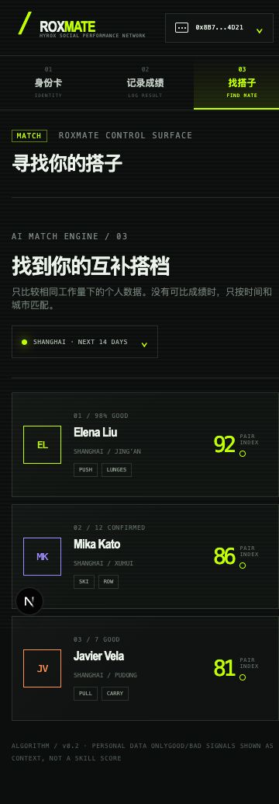
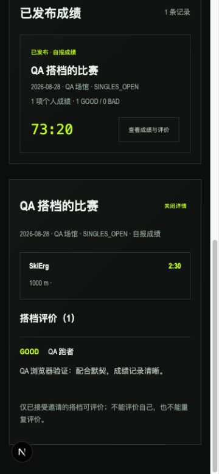

# RoxMate

> **YOUR OWN RECORD. YOUR NEXT PARTNER.**

**HYROX × Monad 的链上运动身份与搭档发现平台。**

RoxMate 把用户自行记录的比赛成绩和搭档关系写入公开链上，形成可核对写入地址与内容的运动履历，并帮助运动者寻找搭档。链上记录不等于赛事官方成绩认证。

产品先找同城候选人，再按组别、项目和工作量比较用户自报的成绩；授权使用 AI 时，Kimi K3 根据匿名匹配信号解释推荐理由。搭档邀请与接受、GOOD / BAD 评价作为独立的链上记录。

<p>
  <a href="https://roxmate-one.vercel.app/">🚀 在线体验</a> ·
  Monad Testnet · Chain ID <code>10143</code>
</p>

## 为什么是 RoxMate？

HYROX 的成绩不只是一个最终用时。搭档是否合拍，还取决于每个项目的节奏、力量分配和协作体验。RoxMate 根据用户自报的可比项目成绩计算基础匹配分；用户授权且 AI 服务可用时，Kimi K3 补充自然语言解释。

## 核心体验

- **建立运动身份**：钱包地址就是身份入口，创建公开的运动员名片。
- **记录个人履历**：发布本人自报的 HYROX 8 个项目、比赛日期、组别、用时及负重/次数等信息。
- **发现合拍搭档**：发现同城候选人，根据可比较的同组别项目成绩计算匹配分数。
- **确认搭档关系**：搭档邀请、接受和关系状态写入 Monad Testnet；接受邀请不核验现实中的合作或成绩。
- **留下搭档评价**：接受搭档邀请后，可对对方已发布成绩留下 GOOD / BAD 反馈，积累可参考的协作信号。
- **Kimi K3 匹配解释**：Kimi K3 只接收匿名匹配分、可比记录对数和匹配理由，不发送钱包、昵称或个人介绍。

## 产品流程

```text
连接钱包 → 创建运动身份 → 记录比赛成绩 → 找到匹配搭档 → 确认搭档关系 → 可选评价
```

## 产品预览

<table>
  <tr>
    <td width="50%"></td>
    <td width="50%"></td>
  </tr>
  <tr>
    <td align="center">运动身份卡 · Personal Records</td>
    <td align="center">比赛成绩录入 · Log Result</td>
  </tr>
  <tr>
    <td width="50%"></td>
    <td width="50%"></td>
  </tr>
  <tr>
    <td align="center">找搭子 · Find Mate</td>
    <td align="center">搭档评价 · Partner Review</td>
  </tr>
</table>

## 为什么使用 Monad？

RoxMate 将身份卡、自报成绩、搭档关系和评价记录在 Monad Testnet 上。任何人都可以核对链上内容和交易地址；成绩真实性仍需自行判断。草稿只保存在当前浏览器，不会写入链上。

## 技术栈

| 层 | 技术 |
| --- | --- |
| Web | Next.js 15 · React 19 · TypeScript |
| Wallet | viem |
| Smart contract | Solidity · OpenZeppelin · Foundry |
| Network | Monad Testnet · Chain ID `10143` |
| Matching | 浏览器端规则匹配 + Kimi K3 匹配解释 |

Registry 合约：`0x2055a709102e37c11eec274e0f456e6d01ec13b8`

修复版合约已于 2026-09-28 部署到 Monad Testnet。旧地址 `0x601c5e9007e52950575b46b84415b152853685d0` 上的用户数据不会自动迁移，需在新地址重新创建身份卡和成绩。部署详情见 [DEPLOYMENT.md](DEPLOYMENT.md)。

## 本地运行与验证

需要 Node.js、npm；合约测试另需 Foundry。默认 RPC 和合约地址已在 Web 应用中配置，无需本地数据库或登录会话密钥。

```bash
cd apps/web
npm ci
npm run dev
```

打开 `http://localhost:3000`。链上写入需要兼容的浏览器钱包和 Monad Testnet 测试币。AI 解释为可选功能；所需服务端变量和限流存储见 [Web 配置说明](apps/web/README.md) 与 [环境变量示例](apps/web/.env.example)。

```bash
cd apps/web
npm test
npm run lint
npm run build
cd ../../contracts
forge test
```

当前操作流程见 [业务流程与操作指南](PERSONAL_WORKFLOW.md)。[产品说明方案](RoxMate_产品说明方案.md)与[技术实现方案](RoxMate_技术实现方案.md)保留了早期设计，仅供参考；其中的双人共同确认成绩、数据库及登录会话等尚非当前线上功能。

## Demo & Submission

- **Live Demo**：[roxmate-one.vercel.app](https://roxmate-one.vercel.app/)
- **Network**：Monad Testnet
- **Tracks**：社会、注意力和文化 · KIMI / Kimi K3
- **AI Model**：Kimi K3
- **状态**：MVP / Hackathon prototype

线上 Demo 主要用于展示产品体验；连接钱包和链上写入需要兼容的钱包以及 Monad Testnet 测试币。

## 下一步

- 完善双钱包端到端的搭档确认体验
- 增加更丰富的成绩趋势、分页和通知能力
- 支持更多赛事类型与训练数据来源
- 进一步完善移动端交互和生产环境监控
