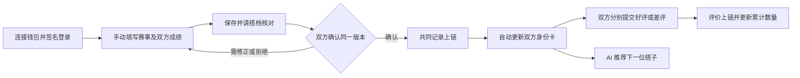

# RoxMate 产品说明方案（PRD）

版本：v0.2｜日期：2026-09-03｜状态：范围冻结；前端、后端与合约 MVP 已实现，尚未部署测试网。  
定位：Monad 上的个人参赛身份、AI 搭子推荐与链上合作评价。  
配套文档：[技术实现方案](/Users/mayjlee/Documents/Codex/Monad/RoxMate_技术实现方案.md)。

## 1. 产品概述与范围冻结

**一句话：赛后手动记录自己与搭档的各项目成绩，双方确认后更新运动身份卡，再通过链上互评积累合作信誉。**

本版本交付范围固定如下：

- 用户通过钱包连接并签名登录；钱包地址是唯一身份凭据。
- 用户手动录入一场双人比赛：比赛名称、地点、日期、组别、搭档，以及双方各项目的独立成绩。
- 双方使用各自钱包确认同一份成绩记录；确认成功后更新双方身份卡。
- 赛后双方分别提交一次 GOOD 或 BAD 评价，身份卡展示累计数量。
- AI 只根据可比较的个人成绩和训练时间推荐搭子，并生成解释文案。
- 不上传图片、不做 OCR；不实现战队、联赛、代币、奖励池、站内聊天或官方成绩认证。

本版 FR/AC 编号为唯一实现与验收依据，不继承旧版图片识别需求。

## 2. 用户、场景与目标

### 2.1 目标用户与角色

| 角色 | 任务 | 权限 |
|---|---|---|
| 比赛记录发起人 | 手动填写赛事、本人和搭档成绩，发送确认请求 | 可编辑未确认草稿；不能代对方签名或评价 |
| 本次搭档 | 核对赛事、双方成绩并确认；评价本次合作 | 可要求修正或拒绝；仅能以本人身份评价 |
| 平台运营 | 处理重复赛事、举报与平台展示问题 | 不得改写链上评价或冒充用户确认 |

本项目面向成年运动者；个人项目计时来自用户自报，必须标为用户记录，不宣称官方独立计时服务。

### 2.2 本次验收目标

| 目标 | 指标与目标 | 口径 / 时间窗 | 数据源 / 责任人 |
|---|---|---|---|
| G1：记录顺利完成 | 录入完成率 ≥70% | 测试期间成功保存完整待确认记录的用户 / 开始填写用户 | 表单事件 / 产品 |
| G2：双方确认为常规行为 | 确认率 ≥60% | 发起后 72 小时内双方确认上链的记录 / 发起满 72 小时的有效请求 | 确认事件 / 产品 |
| G3：形成合作反馈 | 评价覆盖率 ≥40% | 已确认记录中至少有一条评价的记录占比 | 链上评价 / 运营 |
| G4：记录与信誉随身份更新 | 10/10 测试通过 | 10 个新成绩、更正、评价事件都正确更新身份卡，且不重复计数 | 端到端测试 / 测试 |
| G5：推荐有帮助 | 有用反馈率 ≥50% | 测试期间有用反馈 / 全部明确反馈 | 推荐反馈 / 产品 |

搭档确认和好评是合作参考，不构成成绩真实性、参赛资格或运动安全保证。

## 3. 范围与边界

| ID | 本次功能 | 边界 |
|---|---|---|
| FR-00 | 钱包登录与身份确认 | 仅支持钱包签名登录；不设密码登录，不托管私钥 |
| FR-01 | 手动填写比赛记录 | 结构化表单，不提供附件上传 |
| FR-02 | 搭档核对与共同确认 | 双方签署同一份完整记录；不要求先互相好评 |
| FR-03 | 身份卡与记录更新 | 展示个人成绩、搭档历史、记录版本和评价统计 |
| FR-04 | 链上赛后互评 | 仅好评/差评，每场每个方向一次 |
| FR-05 | AI 搭子推荐与展示授权 | 以可比较的个人数据解释推荐；不自动发消息 |

本版本仅覆盖双人比赛。单人赛、接力、官方成绩核验和赛前配对均不实现。

链上记录共同确认、内容哈希和评价结果；完整赛事表单、个人计时、昵称、联系方式和训练时段留在平台。双方签署共同记录即表示同意两钱包的合作关系及评价公开上链。

未获搭档确认时，记录仅在发起人页面显示“待搭档确认 / 未上链”，不能修改对方身份，也不计入已确认场次与评价资格。新记录上链后才更新双方身份卡。

## 4. 总体工作流

录入成绩、确认共同记录、评价合作是三个独立动作。确认记录不是承诺给好评；未评价也不是差评。

## 5. 页面与每场记录结构

### 5.1 三个主要页面与钱包登录入口

| 页面 | 内容与操作 | 状态反馈 |
|---|---|---|
| 钱包登录入口 | 连接钱包、签名登录、切换 Monad 测试网、退出登录 | 未连接时阻止受保护操作；签名被拒绝或网络错误时保留当前页面 |
| 我的身份卡 | 当前个人成绩、历史比赛、当前搭档、待确认记录、好评/差评与不同评价者人数 | 无历史显示“暂无确认成绩”；新交易未确认时不覆盖旧成绩 |
| 比赛记录详情 / 编辑 | 赛事信息、两列个人成绩、核对、确认、更正、我给搭档的评价、搭档给我的评价 | 草稿可编辑；待确认显示差异；已上链标明版本 |
| 找搭子 | 同城同时间候选、个人项目比较、推荐理由、评价统计、用户授权的联系入口 | 数据不可比时只推荐时间合适者，不编造互补结论 |

### 5.2 一场比赛的数据

| 部分 | 字段 | 必填及口径 |
|---|---|---|
| 赛事 | 比赛名称、国家/地区及城市、场馆/地点、比赛日期、组别、规则标准 | 名称、城市、日期、组别必填；场馆可选；未确定标准标 UNKNOWN |
| 参与者 | 本人、搭档 | 两个不同的钱包身份；姓名或昵称不是链上身份凭据 |
| 组合成绩 | 双人组合总用时 | 选填；独立展示，不是个人总成绩 |
| 本人跑步 | 跑步累计用时、实际距离 | 可标未记录；默认不根据组合总用时反推 |
| 搭档跑步 | 搭档跑步累计用时、实际距离 | 由搭档核对，不自动复制本人成绩 |
| 八站成绩 | 每站分别填写本人及搭档的用时、实际完成量、单位、实际负重（适用时） | 用时和完成量可标未记录；没有参加标“未承担”，不是“未记录” |
| 评价 | 本人给搭档、搭档给本人 | 初始均未评价；只读展示对方评价，不允许录入者代填 |
| 记录状态 | 当前版本、确认状态、链上记录 | 系统生成 |

八站为 SkiErg、Sled Push、Sled Pull、Burpee Broad Jump、Rowing、Farmers Carry、Sandbag Lunges、Wall Balls。跑步另列，不用八站用时求和代替全程。

表单按“项目｜我的成绩｜搭档成绩”两列录入；实际完成量与负重作为该项目的可展开字段。缺少这些字段仍可保存，但 AI 不能直接比较不同分工的用时。

## 6. 功能设计

### 6.0 FR-00 钱包登录与身份确认

用户故事：我希望用自己的钱包登录，并确认平台展示的身份就是我控制的钱包地址。

1. 用户必须连接 MetaMask、Rabby 等 EVM 钱包，并签署一次性登录消息；平台不提供邮箱、密码或手机号登录。
2. 服务端校验 nonce、域名、URI、Chain ID、签名和有效期后创建会话；钱包地址作为用户唯一身份 ID。
3. 用户执行记录确认、评价和公开授权前，必须处于有效登录会话，并连接 Monad 测试网；网络不匹配时阻止操作并提示切换。
4. 昵称、城市、训练时段和联系方式是钱包身份下的资料，不得作为身份凭据；客户端传入的 ownerId 不被信任。
5. 登录签名只证明用户控制该钱包，不等同于比赛成绩确认、搭档确认或评价授权；这些动作必须分别签名或发起交易。
6. 平台不接触、不保存用户私钥；会话过期、用户主动断开或切换钱包后，必须重新登录。

验收：AC-00。

### 6.1 FR-01 手动录入

用户故事：我希望赛后直接填一份记录，保存这次与谁参赛、我们各自完成得怎样。

1. 任一参与者可发起，必须选择一个不同于本人的搭档。搭档未注册时提示先邀请其建立钱包身份，不伪造另一参与者。
2. 每人至少填写一项有效个人计时才可发起确认；草稿允许不完整。未知字段为 null，不补 0。
3. 日期不得晚于用户当地当天；每项已记录用时必须为正数；未承担项目的时间和完成量为 0；未记录则都为空。
4. 对不同工作量的项目不直接判谁更强，也不将两人的时间相加作为组合总成绩。
5. 同一赛事、同一对搭档只保留一个合作记录 ID；重复提交打开现有记录，不能多建评价入口。名称变体仍可能造成误判，平台须做重复提示，不能宣称彻底防刷。
6. 收集签名前可编辑。任何一方签名后，内容在 15 分钟有效期内冻结，只可继续确认或等待到期后重新编辑签署；界面撤回不使已有签名立即失效。
7. 搭档可以提出修正；发起人不得直接替搭档填写好评或确认状态。

验收：AC-01、AC-02、AC-03。

### 6.2 FR-02 双方确认

用户故事：我希望确认与我有关的数据，再让这场合作出现在我的身份卡上。

1. 双方签署同一内容哈希，内容包含赛事、两参与者、双方个人成绩和组合成绩。只确认“我认识这个人”不够。
2. 双方确认且交易最终成功后，来源显示 PARTNER_CONFIRMED（双方确认），而不是“官方认证”。
3. 一方拒绝或未响应，记录保持未正式上链；双方可以停止，不强制评价或把拒绝计为差评。
4. 确认动作必须解释钱包关联与好评/差评将公开上链；评价不可因删除平台账户而删除。
5. 新结果不因单方签名、取得 txHash 或交易等待超时而提前计入任一方身份卡。
6. 双方共同确认仍可能串通或记错，也可能有人通过拒绝确认规避评价。本版本不声称解决这些问题。

验收：AC-03、AC-04、AC-05。

### 6.3 FR-03 更新身份卡与成绩

1. 身份卡由“已确认个人成绩＋合作历史＋链上评价统计”组成，不是用户手填好评数量的一张图。
2. 新比赛双方确认后自动进入两人的履历；按比赛日期选择最新成绩，同日按首次链上确认顺序选较新的记录。
3. 补录旧比赛增加历史，不替换更新的当前成绩。每张身份卡取该场对应自己的独立成绩，不能复制搭档数据。
4. 已确认成绩更正必须提出同一记录的新版本并由双方重新签署。等待更正期间原版本继续有效；更正生效后保留旧版历史。
5. 更正不能改变赛事或参与者，不能生成新场次、重开互评次数或清空原差评。赛事或搭档填错必须作为争议标注，不允许静默换人或删记录重来。
6. 更正历史场次只更新该场详情；如果它正是某人的当前成绩，则同步刷新当前卡片与推荐。
7. 收到评价即更新评价统计，不要求被评价者同意，也不要求其重新发布成绩。
8. 身份卡展示“👍好评数 / 👎差评数 / 来自多少位不同搭档”。这里“不同搭档”指不同评价者钱包，不代表已验证的不同自然人。

验收：AC-06、AC-07、AC-08、AC-11。

### 6.4 FR-04 链上合作评价

用户故事：作为本次参赛搭档，我希望对这一次合作表达满意或不满意，并让反馈随身份保留。

1. 只有这场已确认记录的两名参与者能互评；评价对象由系统确定为另一人，禁止自评和第三方评价。
2. 好评 GOOD、差评 BAD 二选一，默认未选；未评价 NONE 不入任何计数。
3. 每场、每个评价者最多一次评价，两个方向独立，不要求同时提交；上链后不编辑或删除，提交前明确确认。
4. 评价绑定稳定的合作记录 ID，附带评价时的成绩版本；之后成绩更正仍保留评价及其原始版本背景。
5. 新评价最终确认后才累加；失败、超时、重复广播及事件重放不重复计数。
6. 同一搭档参加多场可有多条评价，但“不同评价者人数”只增加一次。
7. 好评/差评表示合作体验，不是个人某站成绩的真伪裁决。首版不做文字评论、不因单个差评自动封禁。
8. 评价为公开链上数据，不提供伪双盲承诺；互相报复、串通刷评和多钱包仍是风险。

验收：AC-09、AC-10、AC-11、AC-12。

### 6.5 FR-05 AI 推荐与隐私

1. 筛选本人之外、主动开启可发现的同城用户，每周共同训练时间不少于 30 分钟。
2. 数据必须来自最新已确认版本，且能区分每个人的用时。只用对方授权公开的成绩做推荐。
3. 个人跑步成绩仅在距离相同、标准可比时比较；站点仅在规则、实际完成量、单位和负重均一致时比较。未知负重或数量的项目不进入能力判断。
4. 至少三个站点可比且双方有可比跑步数据时，展示“个人表现参考”；只有存在双方各自相对更好的站点，才能说“相对互补”。否则明确说明未发现互补。
5. 数据不足时只展示同城、共同时间推荐，不再使用旧版单人成绩百分位或 20 人样本门槛。
6. AI 只解释可复算事实；不保证组合成绩，不推断性格、身体状况或提供训练处方。好评/差评和样本量并列展示，不将好评数直接等同能力或自动排名。
7. 可发现默认关闭；联系方式单独选填且默认隐藏。完整周时段不向他人公开，只展示双方共同可约时段。
8. 每人的公开卡片只展示本人授权的成绩及链上已公开的合作/评价信息，不因为共同记录而公开未授权搭档的完整个人分段。
9. 关闭可发现后新的平台请求立即停止展示该用户。链上关系和评价仍公开，不能通过平台开关撤回。

验收：AC-13、AC-14、AC-15。

## 7. 状态、权限与统计口径

### 7.1 业务状态与交易状态分开

| 业务来源 | 触发与前置条件 | 目标 | 失败 / 幂等 / 审计 |
|---|---|---|---|
| DRAFT | 字段合法，发起核对 | AWAITING_CONFIRMATION | 重复发起复用记录；记录草稿版本 |
| AWAITING_CONFIRMATION | 尚未完成签署时搭档拒绝 | DECLINED | 不形成链上记录或差评；保留拒绝记录 |
| DECLINED | 原发起人修正并重新发起 | AWAITING_CONFIRMATION | 新内容必须重新确认 |
| AWAITING_CONFIRMATION | 双方签名匹配、交易最终成功 | CONFIRMED | 同一链事件只应用一次；历史与统计原子更新 |
| CONFIRMED | 提出更正 | CONFIRMED＋待更正提案 | 原成绩仍有效，不重置评价 |
| CONFIRMED＋待更正提案 | 双方确认更正且最终上链 | CONFIRMED，新 revision | 相同事件不重复增版本；旧内容仍留存历史 |

交易单独使用 PREPARED / SUBMITTED / CONFIRMED / FAILED。超时未知保持 SUBMITTED 并核对；确定失败才标 FAILED。评价交易也遵循这一套状态，但不改变比赛确认状态。

一场合作最多有两个评价：A→B、B→A。每个身份的好评数、差评数按已确认评价累加；不同评价者按钱包去重；已确认场次按稳定合作 ID 去重。未确认记录、更正版本和失败交易均不得增加场次。

### 7.2 资料与公开边界

比赛完整记录双方均可查看；个人公开成绩只按本人授权展示。评价交易及两钱包关系一旦上链公开，不是平台可删除的私人评论。

本人可申请关闭账户：立即停止平台发现，7 天内清理昵称、联系方式、偏好和个人未确认草稿；备份 30 天过期。双方已确认的共同记录涉及另一人，保留双方共同签署的最小记录供另一方查阅，不承诺单方删除全份共有记录。

## 8. 异常处理与非功能要求

| 场景 | 处理与验收边界 |
|---|---|
| 搭档未响应 | 保留待确认，不修改对方身份、不开放评价 |
| 钱包未连接、签名被拒绝或网络不匹配 | 阻止创建、确认、评价和授权操作；提示连接并切换到 Monad 测试网 |
| 双方看到不同成绩版本 | 签名校验拒绝；刷新差异后重新核对 |
| 签名过期 | 不自动续签，重新由双方签名 |
| 比赛名或地点重复/有别名 | 提示已有赛事条目；合并元数据不能静默改动既有链上 ID |
| 已确认赛事或参与者填错 | 平台标记争议并显示说明；不伪装合约数据已改正；本版本不提供链上撤销 |
| 评价交易失败/重放 | 不提前计数，也不重复计数 |
| 刷评或恶意差评 | 展示来源与人数、提供举报；不自动删除不利评价或宣称真实性保障 |
| AI 不可用 | 规则筛选及模板解释继续运行，10 秒超时回退 |
| 链不可用 | 原身份维持上次已确认结果，显示同步异常 |

本次质量要求：100 名测试用户下普通读取 P95≤1 秒，规则推荐 P95≤2 秒；最终确认后 60 秒内同步身份视图并在超时告警。私有数据越权测试必须全部拒绝。适配 375 px 手机页面；交易提示可重试且不丢输入。

## 9. 验收标准

### 9.1 功能验收

| ID | 关联 | Given（前提） | When（操作） | Then（预期） |
|---|---|---|---|---|
| AC-00 | FR-00 | 用户连接钱包并签署有效登录消息 | 登录或执行受保护操作 | 服务端建立对应钱包会话；错误链、过期签名、伪造签名和切换钱包均被拒绝；登录签名不能代替成绩确认或评价授权 |
| AC-01 | FR-01 | 有赛事及双方个人成绩 | 手动录入 | 可填写名称、地点、日期、各自成绩及搭档，全流程没有图片入口 |
| AC-02 | FR-01 | 某项目未承担、另一项未记录 | 保存表单 | 0 与 null 区分；个人与组合成绩不相加替代 |
| AC-03 | FR-01/02 | A 已填写 B 的成绩 | A 单方提交或尝试代评 | B 需核对签署；A 不能填写 B 的评价或确认状态 |
| AC-04 | FR-02 | 双方签署一致版本 | 交易最终成功 | 记录确认，双方身份履历更新，显示双方确认而非官方认证 |
| AC-05 | FR-02 | 签名不同、过期或一方拒绝 | 尝试登记 | 不形成正式记录、不开放互评 |
| AC-06 | FR-03 | 本人已有较新比赛 | 补录旧比赛 | 增加历史，当前成绩不回退 |
| AC-07 | FR-03 | 已确认成绩存在错误 | 单方更正后等待 / 双方确认 | 等待期间旧版有效；双方确认才更新新版本 |
| AC-08 | FR-03 | 同一记录更正，已有评价 | 更正成功 | 场次不增加、评价不清空、互评名额不重置 |

### 9.2 数据验收

| ID | 关联 | Given（前提） | When（操作） | Then（预期） |
|---|---|---|---|---|
| AC-09 | FR-04 | 合作已确认 | A 给 B 好评、B 给 A 差评 | 两个方向独立，各增加对应收评价者一个计数 |
| AC-10 | FR-04 | 某方向已评价 | 重复提交、重放事件 | 不新增评价或计数 |
| AC-11 | FR-03/04 | 同一搭档有两场比赛 | 两次评价均成功 | 评价数加 2，不同评价者人数只加 1 |
| AC-12 | FR-04 | 未评价或交易结果未知 | 读取身份卡 | 未评价不计差评，未最终确认不计数 |

### 9.3 边界验收

| ID | 关联 | Given（前提） | When（操作） | Then（预期） |
|---|---|---|---|---|
| AC-13 | FR-05 | 双人总成绩、不同个人工作量或负重 | 请求个人能力比较 | 不把组合表现分配给个人，不比较不同工作量用时 |
| AC-14 | FR-05 | 本人和候选有可比较数据 / 数据不足 | 请求推荐 | 前者有可复算依据；后者明确降级，不伪造互补 |
| AC-15 | FR-05 | 搭档未公开个人成绩或已关闭发现 | 访问公开卡片与推荐 | 不因共同记录泄露其完整分段；关闭者不再被推荐 |

## 10. 版本规划（本次交付与演示范围）

### ROADMAP（不适用）

本项目一次性交付本方案列出的功能，不规划后续版本；未列出的能力均不属于本项目。

| 交付项 | 内容 | 验收 |
|---|---|---|
| 手动记录 | 赛事信息、双方独立成绩、草稿、核对和更正 | AC-01/02/03/06/07/08 |
| 共同确认 | EIP-712 双方签名、链上记录、身份卡更新 | AC-04/05 |
| 赛后评价 | 双向 GOOD/BAD、去重计数、身份卡展示 | AC-09/10/11/12 |
| 钱包身份 | 连接钱包、签名登录、会话与网络校验 | AC-00 |
| AI 找搭子 | 可比较个人数据筛选、推荐理由、隐私授权 | AC-13/14/15 |

演示顺序：A 填写与 B 的比赛→B 核对个人成绩→双方确认上链→展示各自身份卡→互评一次→显示好评/差评数量→新增另一场比赛更新成绩但保留评价。Demo 可以使用模拟身份和成绩，但全程标识，不混入真实运营指标。

## 11. 风险、来源与冻结决策

| 风险 | 应对 / 责任方 |
|---|---|
| 自报成绩与合谋确认 | 只标双方确认，不标官方认证；产品负责人 |
| 拒绝确认规避评价 | 明示信誉覆盖不完整，不保证所有真实合作均有记录；产品负责人 |
| 重复赛事别名和多钱包刷评 | 赛事规范化、人数展示、举报；不宣称完全防刷；技术 / 运营 |
| 个人分工不同导致错误比较 | 保存完成量与负重，限制比较条件；算法负责人 |
| 评价不可删除与个人隐私 | 签名前明示公开信息，提供平台举报；隐私负责人 |

本版本冻结以下决策：使用 Monad 测试网与 EOA 钱包；必须钱包签名登录并以钱包地址确认身份；只支持双人比赛；成绩由用户手动录入；每个项目分别记录两人的独立成绩；双方确认后才上链；评价仅 GOOD/BAD 且每个方向一次；评价不可编辑或删除；不做官方成绩核验、图片/OCR、战队/联赛、代币/奖励、聊天和赛前配对。

HYROX 背景见[官方介绍](https://hyrox.com/about-race/)；不据此假定官方提供个人分段或授予合作资质。

## 12. 质量自检与追溯

| 目标 | 需求 | 核心数据 / 行为 | 验收 |
|---|---|---|---|
| G1/G2 | FR-00/01/02 | 钱包会话、赛事、两份个人成绩、共同签名、稳定记录 ID | AC-00–AC-05 |
| G4 | FR-03 | 最新个人视图、成绩 revision、更正不新增场次 | AC-06–AC-08 |
| G3/G4 | FR-04 | 每方向一次评价、收评价计数、评价者去重 | AC-09–AC-12 |
| G5 | FR-05 | 工作量可比性、推荐降级、展示授权 | AC-13–AC-15 |

本次方案保留状态、权限、失败恢复和三层验收。实现必须严格遵守本章冻结范围，不新增未列出的功能；文档校验不等于代码测试或上线批准。

文档校验：结构检查 0 个错误、0 个警告；15 条验收定义、本地文档链接、共用状态和旧图片处理接口残留已完成核对。前端生产构建、API 类型检查、Worker 类型检查和合约本地测试已通过；尚未部署测试网。
