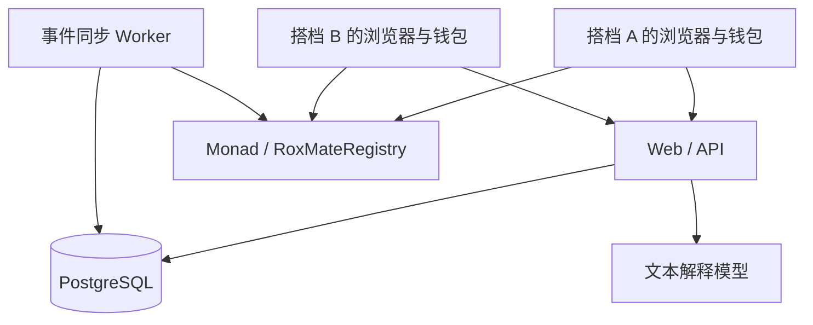

# RoxMate 技术实现方案

版本：v0.2｜日期：2026-09-03｜状态：范围冻结；前端、后端与合约 MVP 已实现，合约已完成本地测试，尚未部署测试网或审计。  
配套文档：[产品说明方案](/Users/mayjlee/Documents/Codex/Monad/RoxMate_产品说明方案.md)。  
本版覆盖 FR-00–FR-05，范围冻结为钱包签名登录、手动填写双方独立成绩、双方共同确认、链上好评差评和 AI 搭子推荐。

## 1. 目标、角色与系统边界

前端为“钱包登录、身份卡、比赛记录、找搭子”四个页面/状态。钱包登录是所有受保护操作的前置条件；后端处理结构化表单、确认协作和推荐；Monad 记录共同确认及评价；AI 只解释个人成绩比较结果。

本版移除上传接口、OCR、视觉模型、图片存储、图片配额和原图保留策略。保留文本模型、数据库、链同步任务和钱包。

任一已登录搭档可创建和核对记录；另一搭档对涉及自己的内容有确认权。录入者不能以对方身份评价。运营只管理平台展示，不能覆写链上成绩版本或评价数量。

## 2. 技术栈与架构

| 层 | 固定选型 | 职责 |
|---|---|---|
| Web/API | Next.js、TypeScript | 表单、核对差异、身份卡、登录、API |
| 数据库 | PostgreSQL | 草稿、两人的独立成绩、签署提案、事件索引、推荐 |
| 钱包 | viem＋钱包连接库，EOA | 登录、EIP-712 签署、发送交易 |
| 合约 | Solidity、Foundry、OpenZeppelin 密码学工具 | 一个 RoxMateRegistry，包含合作记录与评价 |
| Worker | Node 进程＋数据库任务表 | 最终确认同步、幂等计数、缓存失效、到期处理 |
| AI | 服务端文本模型适配器 | 仅解释经规则计算的最少必要事实 |
| 文件/图片系统 | 不需要 | 不建设上传、对象存储或图像处理 |

具体依赖开发前锁版本；Monad 当前兼容工具以[官方部署说明](https://docs.monad.xyz/developer-essentials/summary)为依据。默认测试网，部署配置从[官方网络信息](https://docs.monad.xyz/developer-essentials/testnet)校验，不填写虚构合约地址。



双方可分别签署，再由任一方支付 Gas 提交共同记录。评价由评价者本人发交易；不让后端代持用户私钥。

### 2.1 钱包登录与身份确认

1. 前端连接 EVM 钱包，调用 `POST /auth/nonce` 获取一次性 nonce，用户签署 SIWE 消息后调用 `POST /auth/verify`。
2. 服务端必须校验 nonce、域名、URI、Chain ID、签名地址和有效期；校验成功后以钱包地址创建用户和 Secure/HttpOnly 会话。
3. `users.wallet` 是唯一身份键；昵称、城市和联系方式只是该钱包下的资料，不能替代钱包签名。
4. 记录确认、评价和公开授权必须使用当前有效会话，并要求钱包连接 Monad 测试网；登录签名不能代替这些业务授权。
5. nonce 只能使用一次并在数据库中过期；用户切换钱包、退出或会话过期后必须重新登录。服务端不保存私钥。

## 3. 数据模型与身份卡组成

### 3.1 核心实体

| 实体 | 关键字段 | 约束 |
|---|---|---|
| users | wallet、nickname、cityCode、timeZone、availability、discoverable、contactUrl | wallet 唯一；可发现默认关闭 |
| auth_nonces | nonce、wallet、domain、uri、chainId、expiresAt、usedAt | nonce 一次性使用；过期或已使用不可验证 |
| events | eventKey、name、countryCode、cityCode、venue、localDate、timeZone、division、raceCategory、rulesKey | 用户录入与规范化；不假称官方赛事目录 |
| race_records | resultId、eventKey、memberA、memberB、businessStatus、currentRevision | 同赛事同一对钱包一个稳定 ID |
| result_revisions | resultId、revision、snapshot、salt、dataHash | 已确认版本不可编辑 |
| personal_performances | resultId、revision、wallet、running、stations | 一版恰好两名参与者，各自独立数据 |
| confirmation_proposals | proposalId、resultId、expectedRevision、payload、sigA、sigB、issuedAt、deadline、status | 签署后冻结；过期需新签名 |
| ratings | resultId、rater、subject、rating、ratedRevision、txHash | resultId＋rater 唯一 |
| reputation | wallet、goodCount、badCount、distinctRaters、confirmedRaceCount | 链上为最终依据；数据库为可重建缓存 |
| transactions | operationId、kind、txHash、status | PREPARED / SUBMITTED / CONFIRMED / FAILED |
| chain_events | chainId、contract、txHash、logIndex、blockHash、payload | 四元组 chainId/contract/txHash/logIndex 唯一 |
| match_feedback | requester、requestId、candidate、feedback | 与好评差评分开，仅衡量推荐有用性 |

业务状态为 DRAFT / AWAITING_CONFIRMATION / DECLINED / CONFIRMED。更正是独立 proposal，不把已经 CONFIRMED 的当前记录退回草稿。

界面的来源标签 PARTNER_CONFIRMED 必须根据成功的链上双签确认派生，不能由表单或模型直接写入。待确认草稿只显示“用户记录 / 待搭档确认”，两者都不等于官方核验。

### 3.2 个人项目数据

每名参与者包含：

- running：累计用时 durationSec、实际距离 distanceM、状态。
- stations：八个固定项目键，每项均有 status、durationSec、workAmount、workUnit、loadGrams。
- status：RECORDED（已记录）、NOT_PERFORMED（未承担）、NOT_RECORDED（未记录）。

八站键名：skiErg、sledPush、sledPull、burpeeBroadJump、rowing、farmersCarry、sandbagLunges、wallBalls。

| 字段 | 口径 |
|---|---|
| durationSec | 正整数秒；未承担为 0，未记录为 null |
| workAmount | 实际承担的距离或次数；距离统一整数厘米，次数为整数；未知为 null |
| workUnit | CM / REP；由项目配置限制合法单位 |
| loadGrams | 已知负重以整数克保存；非负重项目为 0，未知负重为 null |
| running.distanceM | 整数米；不能从组合总成绩推算 |
| teamTotalSec | 组合总用时，选填；不进入个人能力比较 |

RECORDED 至少要求 durationSec>0，完成量和负重可缺但不可进入该站的能力比较。NOT_PERFORMED 要求 durationSec=0、workAmount=0；NOT_RECORDED 两者为 null。每名参与者至少一项有效个人计时才可发起确认，草稿不受此限制。

个人时间不等于官方单人分段；用户自记的工作量和计时口径可能不一致，界面持续显示来源。不得把两名参与者用时相加生成组合总时间，也不因组合总时间较快推断双方每个人都更强。

### 3.3 稳定 ID 与版本

eventKey 基于规范化赛事名称、国家/城市、场馆、当地比赛日期、组别、规则键形成。先统一空格、字符规范和受控代码，再冻结序列化；不将链上哈希当作官方赛事认证。

resultId = keccak256(abi.encode(chainId, registryAddress, eventKey, 较小钱包地址, 较大钱包地址))。

两地址按数值排序为 memberA/memberB；发起人不一定是 memberA。同一对人角色对调不会形成新记录。resultId 不包含成绩哈希或 revision，防止更正成绩重置互评次数。

赛事别名仍可形成不同 eventKey，本版本只做应用内重复提示，不能宣称链上保证现实赛事唯一。已确认事件的元信息不能后台改名后暗中换 eventKey。

### 3.4 身份卡是组合视图

身份 ID 为 chainId＋Registry＋wallet。卡片分别读取：

1. 最新已确认比赛中属于该 wallet 的个人成绩。
2. 已确认合作历史及搭档。
3. 收到的好评、差评、不同评价者钱包数。
4. 数据版本、同步状态与公开授权。

不要求用户“重新铸造身份卡”。新合作、更正或评价最终确认后，视图自动更新。评价计数独立于成绩版本，新提交的更快成绩不能覆盖差评。

## 4. 手动录入与共同确认流程

1. 双方连接钱包并完成 SIWE 签名登录；服务端建立与钱包地址绑定的会话。
2. 发起人填写赛事及两列独立个人数据；数据库保存草稿。
3. 搭档登录查看完整记录；只有参与者能访问私有详情。
4. 双方确认内容后冻结快照，生成带期限的签署提案。
5. 两钱包分别签署完全相同的 typed data；任一方可提交交易。
6. Worker 核对最终成功后，记录变为 CONFIRMED，双方履历和身份卡更新。
7. 双方独立决定是否评价，不存在自动好评。

首个签名产生前允许修改；产生后该提案在 15 分钟窗口内冻结。重新编辑需等待旧提案到期并重新核对链状态；不能把“数据库清空签名”当成密码学撤销。

一方拒绝且尚无双方完整授权时可以结束提案；双方签名已产生后，界面不能承诺撤销其链上效力。若第三方持有完整有效签名，可以提交同一授权内容，但不能改成绩、参与者或评价。

## 5. 合约方案：RoxMateRegistry

### 5.1 接口草案

以下接口已按本方案实现于 `contracts/src/RoxMateRegistry.sol`；合约已完成本地测试，尚未完成测试网部署和安全审计。

```solidity
struct ResultAttestation {
    bytes32 eventKey;
    address memberA;
    address memberB;
    uint64 raceDayStart;
    bytes32 dataHash;
    uint64 expectedRevision;
    uint64 issuedAt;
    uint64 deadline;
}

enum Rating { NONE, GOOD, BAD }

function confirmResult(
    ResultAttestation calldata data,
    bytes calldata signatureA,
    bytes calldata signatureB
) external;

function rateResult(
    bytes32 resultId,
    uint64 expectedRevision,
    Rating value
) external;

// 查询设计需同时暴露当前记录、历史事件及个人统计。
function getResult(bytes32 resultId) external view returns (ResultHead memory);
function getIdentity(address member) external view returns (IdentityView memory);
function getRating(bytes32 resultId, address rater) external view returns (RatingView memory);

event ResultConfirmed(
    bytes32 indexed resultId,
    address indexed memberA,
    address indexed memberB,
    bytes32 eventKey,
    uint64 raceDayStart,
    uint64 revision,
    bytes32 dataHash
);

event RatingSubmitted(
    bytes32 indexed resultId,
    address indexed rater,
    address indexed subject,
    Rating value,
    uint64 ratedRevision
);
```

ResultHead 包含 eventKey、memberA/memberB、raceDayStart、currentHash、revision、firstConfirmedAt。IdentityView 包含 latestResultId、confirmedRaceCount、goodCount、badCount、distinctRaters。RatingView 包含 value、ratedRevision、createdAt；不存在时 value=NONE。

raceDayStart 为当地比赛日期零点对应的 UTC 秒，不声称它是实际开赛或完赛时刻。前端须由用户确认“比赛已结束”；链上只能排除未来日期，不能独立验证实际完赛。

### 5.2 共同确认与更正校验

confirmResult 必须：

1. 拒绝零地址、相同参与者、未排序地址、空哈希与未来 raceDayStart。
2. 要求 issuedAt≤block.timestamp≤deadline，且 deadline-issuedAt 在 1–900 秒之间。
3. EIP-712 domain 绑定 name=RoxMateRegistry、version=2、chainId、verifyingContract；验签得到的地址必须分别是 memberA、memberB。
4. 新记录只接受 expectedRevision=0；已有记录必须等于链上 revision，并保持 eventKey、参与者和 raceDayStart 不变。
5. 新版本哈希不得等于当前哈希；成功后 revision 只增加一次。
6. 首次登记增加双方 confirmedRaceCount；更正不能再次增加场次。
7. 首次登记按日期更新双方 latestResultId；同日按首次链上确认顺序处理，后登记的新记录成为当前。更正不改变 latestResultId 的选择，只刷新该记录已有视图。
8. 无论新建还是更正，都不清空 ratings 或个人评价统计。

成绩更正仍调用 confirmResult，只是 expectedRevision>0 且双方签署新 dataHash。合约不读取明文赛事或个人成绩，因此字段含义、eventKey 与正文一致性还需客户端校验和双方核对；不能宣称验签验证了成绩真实性。

EIP-712 本身不包含重放保护，因此本方案额外依靠稳定 resultId、expectedRevision、签署期限和 domain 限制重放。[EIP-712](https://eips.ethereum.org/EIPS/eip-712)

本版本仅支持普通 EOA，使用成熟 EIP712/ECDSA 工具验证，不自行编写密码学；不支持 ERC-1271 智能合约钱包。[OpenZeppelin 密码学工具](https://docs.openzeppelin.com/contracts/5.x/api/utils/cryptography)

### 5.3 评价校验与计数

rateResult 必须验证记录存在、msg.sender 属于两参与者、expectedRevision 是当前版本、value 为 GOOD 或 BAD，且该 resultId 下 msg.sender 尚未评价。

subject 自动取另一参与者，不接收可任意指定的评价对象。成功时：

- 保存 ratings[resultId][msg.sender]，并附上 ratedRevision。
- 增加 subject 对应的 goodCount 或 badCount。
- 若 seenRater[subject][msg.sender] 为 false，设置为 true，distinctRaters 加 1。
- 发出 RatingSubmitted(resultId, rater, subject, value, ratedRevision)。

即使更正成绩使 revision 改变，已有评价仍视为已使用该场该方向的名额。重复交易必须回滚，不提供评价编辑/删除接口。NONE 不允许通过 rateResult 写入。

合约不托管资金、不调用用户指定外部合约、不设置管理员覆写评价入口，不发行可转让身份 NFT。原 v0.1 只是文档，本次无需执行任何真实合约迁移。

## 6. 快照、安全签名与链下同步

### 6.1 快照哈希

冻结 snapshot 包含 schemaVersion、chainId、registryAddress、resultId、eventKey、revision、赛事信息、两参与者、双方个人数据、组合成绩。评价不包含在成绩快照内，由独立交易记录。

```text
canonical = JCS(snapshot)
innerHash = keccak256(UTF8(canonical))
salt = 安全随机 32 字节
dataHash = keccak256(abi.encode(bytes32 innerHash, bytes32 salt))
```

使用确定性 JSON 表示，避免键顺序差异造成哈希不同，参见 [RFC 8785](https://www.rfc-editor.org/info/rfc8785/)。时间与工作量为整数，uint64 和链 ID 用十进制字符串序列化；未知值明确为 null。签名前前端重新计算哈希，并展示对应完整明文。

同一提案重试复用 snapshot 和 salt；更正产生新快照，保留旧版。完整共同快照和 salt 仅两参与者可读取或导出，导出时提醒它包含搭档的数据。平台不给第三方导出共同快照，只可公开本人授权的展示字段。

加盐哈希不意味着所有信息私密：参与钱包、eventKey、版本及评价本来就在链上公开；赛事键也可能被枚举推知。

### 6.2 最终确认与恢复

Worker 必须核对链、合约、交易成功状态、事件、resultId、dataHash、revision 和区块最终确认，才能更新身份或计数。Monad 收据出现可能早于最终确认，不能只看 txHash 就显示成功。[Monad 开发说明](https://docs.monad.xyz/developer-essentials/summary)

- 交易使用 PREPARED→SUBMITTED→CONFIRMED；确定回滚才转 FAILED。
- 超时未知保持 SUBMITTED，继续查询原交易及可能的替换交易，不盲目要求再次支付。
- 浏览器广播后崩溃时，Worker 根据 resultId/hash 或评价者和记录 ID 补回交易，不依赖浏览器回调才能完成。
- chain_events 唯一键去重；在一个数据库事务中写事件、推进记录/评价视图、更新统计及 cursor。
- 对成绩使用 revision 单调推进；迟到旧事件只补历史，不回退当前版本。评价按 resultId/rater 去重。
- 按 blockNumber、transactionIndex、logIndex 处理同批事件；个人 latestResultId 最终与 getIdentity 返回值对账，避免旧比赛的迟到事件错误覆盖最新比赛。
- 定期从合约重新读取个人计数进行对账；不同时用“事件累加”和“合约总数相加”导致双算。
- 签名过期前已发送的交易也可能因执行时过期失败；只有最终确认才生效，失败后双方重新核对再签名。
- 若链上出现合法双签但平台缺少对应明文的外部更新，显示“数据待同步”，暂停该版本的成绩推荐；历史评价统计仍按链上展示。

## 7. AI 推荐：比较个人，而不是比较双人总分

### 7.1 筛选与可比条件

首先筛选同城、主动开启可发现、未删除或被屏蔽、且每周共同训练时间不少于 30 分钟的用户。未有可比较个人成绩的账户只能进入时间推荐。

训练时段保存 IANA 时区，将未来 14 天区间转换为 UTC 后求交，重叠总分钟数除以 2 得到每周平均。不得返回对方完整日程。

每名候选使用其当前最新已确认比赛中对应本人的成绩，不选各场最优分段拼接。超过 180 天的成绩仅作历史展示，不参与表现排序。

个人跑步可比条件：同标准、同组别、实际距离相同且均有正用时。个人站点可比条件：同站、同规则标准、同实际完成量、同单位、同负重且数据均已记录。非负重项目 loadGrams=0，未知为 null，两者不能视为相同。

本版本固定两种模式：

| mode | 进入条件 | 展示 |
|---|---|---|
| PERFORMANCE_MATCH | 双方个人跑步可比，且至少 3 个站点可比 | 时间、节奏和相对项目表现；有双向优势时才说互补 |
| SCHEDULE_ONLY | 仅基础发现条件成立 | 同城与共同时间；明确个人成绩不足以比较 |

这里“双方”是寻找搭子的两位用户，不是把历史记录中的整个双人组合当作一个人。来自不同历史搭档的成绩存在情境差异，文案需说明只是参考。

### 7.2 参考分与解释依据

以下规则为本版本唯一计算口径，不宣称科学验证或组合成绩预测。

```text
T = min(每周共同训练分钟数 / 120, 1)
paceA = 本人跑步用时 / (本人跑步距离米 / 1000)
paceB = 候选跑步用时 / (候选跑步距离米 / 1000)
P = max(0, 1 - abs(paceA - paceB) / max(paceA, paceB) / 0.20)

对每个可比站点 k：
delta[k] = (候选用时[k] - 本人用时[k]) / max(候选用时[k], 本人用时[k])
advantageA = max(0, 所有 delta[k])
advantageB = max(0, 所有 -delta[k])
C = min(1, min(advantageA, advantageB) / 0.20)

PERFORMANCE_MATCH 分数 = round(100 * (0.50*T + 0.30*P + 0.20*C))
SCHEDULE_ONLY 分数 = round(100 * T)
```

C 只有双方各至少一个相对更快站点时才大于 0；若一方全部更快，不能称“互补”。不计算全国排名或群体百分位，删除旧版对 20 人参考样本的依赖。

先展示 PERFORMANCE_MATCH，余位可补 SCHEDULE_ONLY，但不同模式不把分数混成同一成功概率；每种模式内按分数、共同时间、用户 ID 稳定排序，最多 5 人。

评价数量只作独立的合作参考展示。不以好评总数提升所谓个人力量值，不因为一个差评自动过滤候选。

### 7.3 模型输入输出与降级

仅把匿名候选 ID、mode、共同时间、计算出的相对站点优势、数据缺失标志交给文本模型。数字由 UI 从结构化结果展示，不让模型自由生成成绩、工作量、评价计数。

模型输出 candidateId、reasonCodes、最多 120 字的 summary、最多 80 字的 caution。reasonCodes 必须是服务端已提供的证据代码；越界站点、未经证明的性格描述、成绩保证或医疗建议均丢弃，改用模板。

推荐计算和基础结果不依赖模型成功；文本 10 秒超时回退。每用户每天最多 10 次新解释请求，缓存命中不重复付费；不调用视觉模型。

缓存包含双方 resultId/revision、偏好版本、授权版本、算法版本。成绩更正、最新比赛变化或展示授权变化立即失效；授权需在返回缓存前再检查。评价独立读取最新计数，不沿用旧文案中的计数。

## 8. API、权限与幂等

统一前缀 /api/v1。以下是设计端点，不是已上线服务。

| 接口 | 作用 | 权限与边界 |
|---|---|---|
| POST /auth/nonce、POST /auth/verify | 钱包签名登录与身份确认 | 一次性 nonce，必须验证域、URI、Monad 测试网 Chain ID、签名及期限 |
| GET /events/search | 查找可能相同赛事 | 只搜索赛事元数据，不返回私人比赛记录 |
| POST /records | 创建手动记录草稿 | 从会话确定发起人，必须属于两参与者之一 |
| PATCH /records/:id/draft | 编辑未冻结草稿 | 参与者可提出修改；修改后双方重新核对 |
| POST /records/:id/request-confirmation | 发起核对 | 字段合法；同赛事同对人复用现有记录 |
| POST /records/:id/decline | 拒绝核对 | 仅参与者；已有完整有效双签时不可宣称撤销 |
| POST /records/:id/prepare | 冻结快照与签署提案 | 服务端读取当前 revision；幂等返回同一盐及数据 |
| POST /proposals/:id/signature | 提交本人签名 | 校验当前会话对应签名人和完整 payload |
| GET /proposals/:id/transaction | 取得共同确认交易参数 | 仅参与者，双签匹配且未过期 |
| POST /records/:id/corrections | 提出已确认记录的新版本 | 参与者可提，赛事与搭档不变，仍须双签 |
| POST /records/:id/ratings/prepare | 返回本人评价交易参数 | 对象从合作关系推导；不能传任意 rater/subject |
| POST /transactions | 记录 txHash 与 operationId | 验证交易相关性，不接受客户端设置成功状态 |
| GET /identities/me | 本人完整身份卡与待确认记录 | 私有；包含本人收到的链上评价 |
| GET /identities/:wallet/public | 公开身份卡 | 按被查看者授权返回其个人字段，链上评价单独标识 |
| GET /records/:id | 赛事、双方个人成绩及两个方向评价 | 完整版仅参与者；公开卡仅给本人授权投影 |
| GET /records/:id/export | 下载共同确认快照与校验材料 | 仅两参与者，明确包含搭档数据并记录审计 |
| PATCH /preferences | 昵称、城市、时间、可发现、联系入口 | 仅本人，修改不触发链上成绩更正 |
| GET /matches、POST /matches/feedback | 推荐及有用性反馈 | 有用性反馈不写入合作好评/差评计数 |
| POST /reports | 举报平台展示或争议 | 保存证据与处理记录，不篡改链上评价 |
| DELETE /account | 停止展示并执行删除策略 | 不能单方删除共有记录或已公开链上评价 |

身份登录可采用 [SIWE](https://eips.ethereum.org/EIPS/eip-4361)。登录签名、记录共同确认签名、评价交易是不同授权，不可互相替代。

会话使用 Secure/HttpOnly Cookie，写入校验 Origin 和 CSRF。API 的 Idempotency-Key 绑定用户、路径和请求体哈希；同键同请求复用，同键不同内容返回冲突。敏感字段取会话身份，不信任客户端 ownerId。

数据库对 resultId 和提案使用行锁。链上仍必须校验 expectedRevision，不能用数据库锁代替。单个 resultId 同时只允许一个签署窗口；任一方签名后不得在窗口内编辑同一提案。

| 错误码 | 恢复动作 |
|---|---|
| INVALID_RESULT / INVALID_WORKLOAD | 定位字段并保留表单，不自动猜值 |
| AUTH_REQUIRED / WRONG_CHAIN | 阻止受保护操作，提示重新登录或切换 Monad 测试网 |
| NONCE_INVALID / SIGNATURE_INVALID | 丢弃登录请求，不创建或续期会话 |
| RECORD_EXISTS | 打开同赛事同搭档已有记录 |
| PROPOSAL_FROZEN | 显示期限，继续签署或到期后重开 |
| SIGNATURE_EXPIRED / SIGNATURE_MISMATCH | 重新读取完整内容并由双方签署 |
| REVISION_CONFLICT | 先检查链上已生效版本，再准备新提案 |
| IMMUTABLE_FIELDS_CHANGED | 不允许更换已确认赛事或参与者 |
| ALREADY_RATED | 展示该方向已存在评价，禁止重复计数 |
| NOT_PARTICIPANT | 拒绝核对、修改或评价 |
| CHAIN_UNAVAILABLE | 保留未确认状态，暂停新增计数 |
| AI_UNAVAILABLE | 使用规则及模板解释 |

业务事件记录 record_draft_saved、confirmation_requested、result_confirmed、result_revised、rating_confirmed、match_viewed、match_feedback；不把签名请求次数当成功上链次数。

## 9. 安全、保留策略与非功能要求

1. 完整个人数据不直接写入链上 calldata；链上是数据哈希、参与钱包、赛事键、版本和评价。公开关系在签署前必须告知。
2. 草稿和完整共享记录由两参与者访问，公众只读各人独立授权的字段。关闭发现立即从新平台响应移除，但不能删除已有链上记录。
3. 账户删除立即停止发现；7 天内删除联系方式、偏好和本人未确认草稿；备份 30 天过期。已确认共有记录和版本作为两人共同资料保留，仅供参与者查看；不能单方删除整个记录。
4. 日志保留 30 天，仅存操作 ID、状态及错误码，不存完整成绩、盐、签名、联系方式或模型密钥。
5. 前后端转义赛事名称、地点和昵称；联系 URL 仅允许 HTTP(S)。不抓取用户给出的任意远程 URL。
6. 无资金托管，不因好评发奖励，不宣称防止多钱包互刷。运营可标记争议或隐藏平台推荐，但不能悄悄减少差评总数。

本次质量要求：100 人测试集下读取 P95≤1 秒、规则推荐 P95≤2 秒；链最终确认后 60 秒内更新身份并在超时告警；不承诺固定确认耗时。数据库每天备份，RPO 24 小时、RTO 4 小时。

## 10. 验收与技术测试

产品 AC-00–AC-15 是验收主线。以下是实现时需执行的测试，不表示已经运行合约或产品代码。

| ID | 对应 AC | Given / When / Then 摘要 |
|---|---|---|
| TC-00 | AC-00 | 有效 SIWE 建立正确钱包会话；错误链、过期/重复 nonce、伪造签名和切换钱包均被拒绝；登录签名不能代替业务授权 |
| TC-01 | AC-01/02 | 手动输入双方数据后，字段区分个人/组合、未承担/未记录；不存在上传或 OCR 调用 |
| TC-02 | AC-03/05 | 单签、伪造另一人、错误 domain、不同 hash 或过期双签不得确认记录 |
| TC-03 | AC-04 | 正确双签首次上链，两人场次各增 1，各卡读取属于自己的成绩 |
| TC-04 | AC-06 | 补录旧比赛不回退 latestResultId；同日新记录按首次确认顺序选当前 |
| TC-05 | AC-07/08 | 更正成功仅 revision 递增，不增场次，不重开评价，不换事件或参与者 |
| TC-06 | AC-09 | A 给 B 好评、B 给 A 差评，只改变各自收评价对象的正确计数 |
| TC-07 | AC-10/11 | 同一评价重复调用回滚；同一钱包第二场评价只增加评价数不增加 distinctRaters |
| TC-08 | AC-12 | 未评价、提交失败及超时未知都不计差评或成功评价 |
| TC-09 | AC-13/14 | 组合总时间不参与个人比较；负重或工作量不同的站点被排除 |
| TC-10 | AC-14 | 一方所有可比项目均更快时 C=0，不能写成双方互补；不足三站降级 |
| TC-11 | AC-15 | 共同记录公开投影不能泄露未授权搭档分段；撤权后缓存请求仍拒绝展示 |
| TC-12 | AC-04/08/10 | 事件重放、乱序或浏览器中断不重复计数、不丢确认、不回退版本 |
| TC-13 | AC-05/07 | 已签名提案不能通过清数据库假装撤销；更正竞争只允许一个 expectedRevision 成功 |
| TC-14 | AC-14 | AI 编造成绩、评价或无依据的人格判断时丢弃文案，用模板代替 |

算法至少准备：相同/不同负重、相同/不同分工量、空值和 0、双向优势/单向优势、无共同时间、历史数据到期的固定样例。合约需包含属性测试：每场每人最多一评、good+bad 等于收到的成功评价数、distinctRaters 不大于评价总数、revision 不倒退。

## 11. 本次实施任务与交付清单

| 顺序 | 工作包 | 依赖 |
|---|---|---|
| D1–D3 | 表单、赛事规范化、两人个人数据 Schema、登录与草稿核对 | 明确字段单位与授权 |
| D4–D6 | 单合约、双签确认、稳定 ID、版本更正及测试 | Schema、钱包接口 |
| D7–D9 | 互评、身份统计、事件重放、公开投影 | 合约确认与索引 |
| D10–D12 | 个人数据比较、AI 解释、降级与隐私控制 | 成绩和授权可用 |
| D13–D15 | 边界回归、测试网演示、部署与使用说明 | 全链路联调 |

以上是本次实现顺序，不包含未列出的功能。

工程目录固定为：apps/web（页面/API）、apps/worker（链上同步）、packages/domain（Schema/规则）、packages/chain（ABI/typed data）、contracts（RoxMateRegistry/测试）。本次已创建前端、后端、Worker 和合约代码；尚未部署测试网或发送消息给任何搭档。

交付必须包含三页 Web、合约源码与验证信息、数据库迁移、测试、环境变量样例、部署说明、显著标识的模拟成绩及演示视频。官方成绩核验、合约升级、评价撤销和真人去重不在本项目内。

## 12. 风险与冻结边界核对

| 决策 / 风险 | 固定处理 |
|---|---|
| 双方确认会增加首次建档等待 | 未确认私有显示，正式身份待双方确认 |
| 个人用时未必可比 | 工作量/负重缺失时不算该站能力 |
| 拒绝确认、互相报复或合谋 | 不宣称评价保障真实；展示来源和数量，保留举报 |
| 赛事别名导致重复、钱包代表同一人 | 只能有限提示，distinctRaters 是钱包数而非实名认证人数 |
| 共有人数据删除与链上公开评价 | 签名前明示；共有记录保留，链上评价不可删除 |
| 网络、钱包和部署 | 只使用 Monad 测试网与 EOA，不部署主网 |

与产品方案共用：FR-00–FR-05、AC-00–AC-15；DRAFT / AWAITING_CONFIRMATION / DECLINED / CONFIRMED；PREPARED / SUBMITTED / CONFIRMED / FAILED；GOOD / BAD / NONE；PERFORMANCE_MATCH / SCHEDULE_ONLY。

最终结论：本项目只实现“钱包签名登录并确认身份→手动录入两人个人成绩→双方共同确认上链→身份卡更新→GOOD/BAD 互评→AI 推荐搭子”闭环。任何未在 FR-00–FR-05、API 表和验收用例中列出的能力均不属于本项目；本地测试通过不等于测试网部署或合约安全审计完成。
